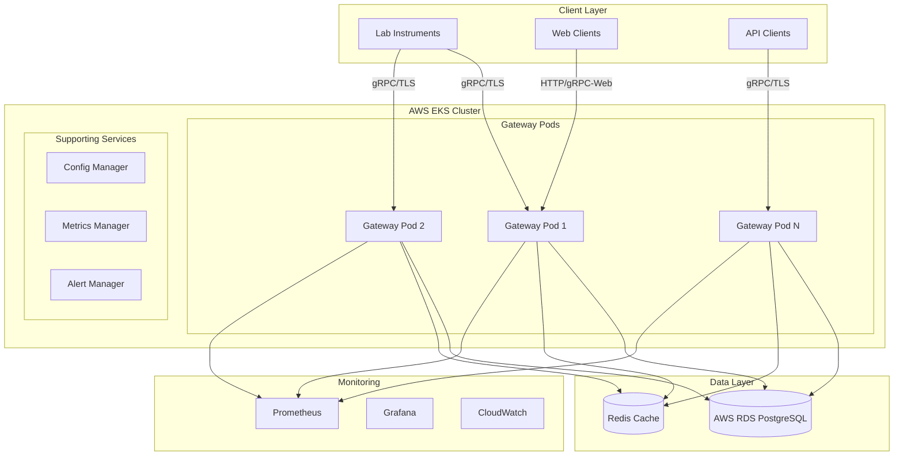

# Design Document

## Overview

The Lab Instrument API Gateway is designed as a high-performance, cloud-native gRPC service that acts as a centralized hub for laboratory instrument management. The system employs a microservices architecture with event-driven communication patterns, deployed on AWS EKS with PostgreSQL for data persistence. The design prioritizes horizontal scalability, fault tolerance, and real-time data processing capabilities.

## Architecture

### High-Level Architecture



### Service Architecture

The gateway follows a layered architecture pattern:

1. **Transport Layer**: gRPC server with TLS termination
2. **Service Layer**: Business logic and orchestration
3. **Repository Layer**: Data access abstraction
4. **Infrastructure Layer**: External service integrations

## Components and Interfaces

### Core Components

#### 1. gRPC Server
- **Purpose**: Handle incoming gRPC connections and route requests
- **Key Features**:
  - Connection pooling and lifecycle management
  - TLS termination with mutual authentication
  - Request/response interceptors for logging and metrics
  - Graceful shutdown handling

#### 2. Device Manager
- **Purpose**: Manage device registration, status, and lifecycle
- **Key Features**:
  - Device authentication and authorization
  - Connection state tracking
  - Health monitoring and heartbeat management
  - Device metadata persistence

#### 3. Stream Manager
- **Purpose**: Handle bidirectional streaming connections
- **Key Features**:
  - Concurrent stream management using goroutines
  - Buffered channels for high-throughput data processing
  - Stream lifecycle management (connect, disconnect, error handling)
  - Backpressure handling and flow control

#### 4. Command Router
- **Purpose**: Route commands to appropriate devices
- **Key Features**:
  - Command validation and sanitization
  - Asynchronous command execution
  - Command status tracking and timeout handling
  - Response correlation and delivery

#### 5. Data Processor
- **Purpose**: Process and validate incoming measurement data
- **Key Features**:
  - Real-time data validation and transformation
  - Batch processing for database writes
  - Data quality checks and anomaly detection
  - Time-series data optimization

#### 6. Query Engine
- **Purpose**: Handle historical data queries and analytics
- **Key Features**:
  - Efficient time-range queries with indexing
  - Data aggregation and statistical functions
  - Pagination and result streaming
  - Query optimization and caching

### Interface Definitions

#### gRPC Service Interface

```protobuf
service LabInstrumentGateway {
  // Device management
  rpc RegisterDevice(RegisterDeviceRequest) returns (RegisterDeviceResponse);
  rpc GetDeviceStatus(GetDeviceStatusRequest) returns (GetDeviceStatusResponse);
  rpc ListDevices(ListDevicesRequest) returns (ListDevicesResponse);
  
  // Real-time streaming
  rpc StreamData(stream StreamDataRequest) returns (stream StreamDataResponse);
  
  // Command execution
  rpc SendCommand(SendCommandRequest) returns (SendCommandResponse);
  
  // Historical data
  rpc GetMeasurements(GetMeasurementsRequest) returns (GetMeasurementsResponse);
  
  // Health and monitoring
  rpc HealthCheck(HealthCheckRequest) returns (HealthCheckResponse);
}
```

#### Internal Service Interfaces

```go
type DeviceManager interface {
    RegisterDevice(ctx context.Context, req *RegisterDeviceRequest) (*Device, error)
    GetDevice(ctx context.Context, deviceID string) (*Device, error)
    UpdateDeviceStatus(ctx context.Context, deviceID string, status DeviceStatus) error
    ListDevices(ctx context.Context, filter DeviceFilter) ([]*Device, error)
}

type StreamManager interface {
    CreateStream(ctx context.Context, deviceID string) (*Stream, error)
    HandleStreamData(ctx context.Context, stream *Stream, data *MeasurementData) error
    CloseStream(ctx context.Context, streamID string) error
    GetActiveStreams() map[string]*Stream
}

type CommandRouter interface {
    SendCommand(ctx context.Context, deviceID string, cmd *Command) (*CommandResponse, error)
    GetCommandStatus(ctx context.Context, commandID string) (*CommandStatus, error)
}
```

## Data Models

### Core Entities

#### Device
```go
type Device struct {
    ID          string    `json:"id" db:"id"`
    Name        string    `json:"name" db:"name"`
    Type        string    `json:"type" db:"type"`
    Status      string    `json:"status" db:"status"`
    LastSeen    time.Time `json:"last_seen" db:"last_seen"`
    Metadata    JSON      `json:"metadata" db:"metadata"`
    CreatedAt   time.Time `json:"created_at" db:"created_at"`
    UpdatedAt   time.Time `json:"updated_at" db:"updated_at"`
}
```

#### Measurement
```go
type Measurement struct {
    ID        string    `json:"id" db:"id"`
    DeviceID  string    `json:"device_id" db:"device_id"`
    Timestamp time.Time `json:"timestamp" db:"timestamp"`
    Type      string    `json:"type" db:"type"`
    Value     float64   `json:"value" db:"value"`
    Unit      string    `json:"unit" db:"unit"`
    Quality   string    `json:"quality" db:"quality"`
    Metadata  JSON      `json:"metadata" db:"metadata"`
}
```

#### Command
```go
type Command struct {
    ID        string    `json:"id" db:"id"`
    DeviceID  string    `json:"device_id" db:"device_id"`
    Type      string    `json:"type" db:"type"`
    Payload   JSON      `json:"payload" db:"payload"`
    Status    string    `json:"status" db:"status"`
    CreatedAt time.Time `json:"created_at" db:"created_at"`
    ExpiresAt time.Time `json:"expires_at" db:"expires_at"`
}
```

### Database Schema

#### Tables
- `devices`: Device registration and metadata
- `measurements`: Time-series measurement data (partitioned by time)
- `commands`: Command execution tracking
- `device_sessions`: Active connection tracking
- `alerts`: System alerts and notifications

#### Indexes
- `measurements_device_timestamp_idx`: Optimized for time-range queries
- `devices_status_idx`: Fast device status lookups
- `commands_device_status_idx`: Command tracking queries

## Error Handling

### Error Categories

1. **Validation Errors**: Invalid input data or parameters
2. **Authentication Errors**: Device or client authentication failures
3. **Resource Errors**: Database connection, memory, or CPU constraints
4. **Network Errors**: Connection timeouts, stream interruptions
5. **Business Logic Errors**: Device state conflicts, command failures

### Error Response Strategy

```go
type ErrorResponse struct {
    Code    string `json:"code"`
    Message string `json:"message"`
    Details map[string]interface{} `json:"details,omitempty"`
}
```

### Retry and Circuit Breaker Patterns

- **Database Operations**: Exponential backoff with jitter
- **External Service Calls**: Circuit breaker with health checks
- **Stream Reconnection**: Progressive backoff with maximum retry limits

## Testing Strategy

### Unit Testing
- **Coverage Target**: 90% code coverage
- **Focus Areas**: Business logic, data validation, error handling
- **Tools**: Go testing framework, testify, gomock

### Integration Testing
- **Database Integration**: Test with real PostgreSQL instance
- **gRPC Integration**: Test full request/response cycles
- **Stream Testing**: Concurrent connection and data flow tests

### Performance Testing
- **Load Testing**: Simulate 1000+ concurrent connections
- **Stress Testing**: Test system behavior under resource constraints
- **Endurance Testing**: Long-running stability tests

### End-to-End Testing
- **Scenario Testing**: Complete workflow validation
- **Failure Testing**: Network partitions, database failures
- **Recovery Testing**: System recovery after failures

## Deployment Architecture

### Kubernetes Configuration

#### Resource Requirements
```yaml
resources:
  requests:
    memory: "512Mi"
    cpu: "250m"
  limits:
    memory: "2Gi"
    cpu: "1000m"
```

#### Autoscaling Configuration
```yaml
apiVersion: autoscaling/v2
kind: HorizontalPodAutoscaler
spec:
  minReplicas: 3
  maxReplicas: 20
  targetCPUUtilizationPercentage: 70
  targetMemoryUtilizationPercentage: 80
```

### AWS EKS Integration
- **Node Groups**: Mixed instance types for cost optimization
- **Load Balancer**: AWS Application Load Balancer with SSL termination
- **Storage**: EBS volumes for persistent data
- **Networking**: VPC with private subnets and NAT gateways

### Database Configuration
- **AWS RDS**: Multi-AZ PostgreSQL with read replicas
- **Connection Pooling**: PgBouncer for connection management
- **Backup Strategy**: Automated daily backups with point-in-time recovery

## Security Considerations

### Authentication and Authorization
- **mTLS**: Mutual TLS for device authentication
- **JWT Tokens**: For API client authentication
- **RBAC**: Role-based access control for different user types

### Data Protection
- **Encryption at Rest**: Database and storage encryption
- **Encryption in Transit**: TLS 1.3 for all communications
- **Secrets Management**: AWS Secrets Manager integration

### Network Security
- **Security Groups**: Restrictive ingress/egress rules
- **Network Policies**: Kubernetes network segmentation
- **VPC Configuration**: Private subnets with controlled internet access

## Monitoring and Observability

### Metrics Collection
- **Application Metrics**: Request rates, response times, error rates
- **Business Metrics**: Device counts, message throughput, command success rates
- **Infrastructure Metrics**: CPU, memory, network, disk utilization

### Logging Strategy
- **Structured Logging**: JSON format with consistent fields
- **Log Levels**: DEBUG, INFO, WARN, ERROR, FATAL
- **Log Aggregation**: Centralized logging with retention policies

### Alerting Rules
- **Critical Alerts**: Service unavailability, database failures
- **Warning Alerts**: High resource utilization, elevated error rates
- **Info Alerts**: Deployment events, configuration changes

### Health Checks
- **Liveness Probe**: Basic service availability
- **Readiness Probe**: Service ready to accept traffic
- **Startup Probe**: Initial service startup validation